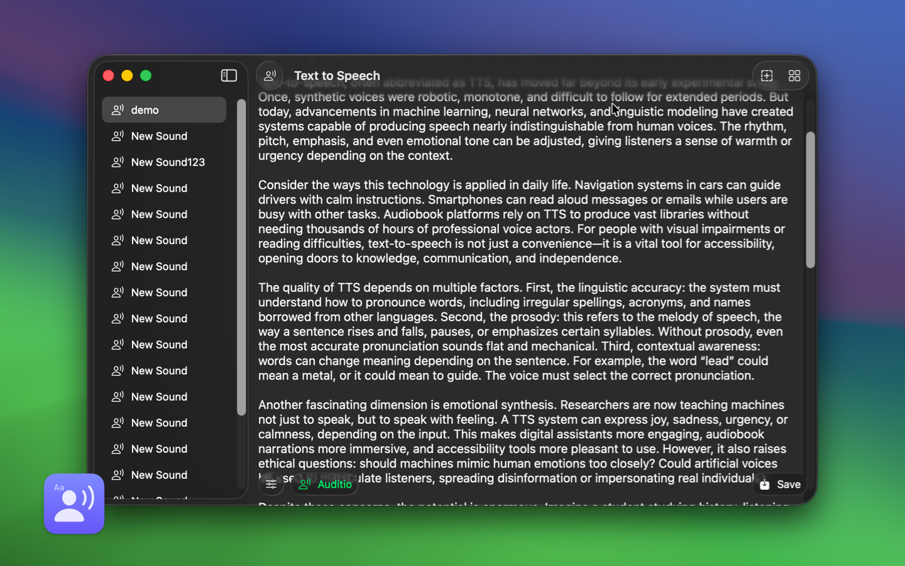

<!--idoc:ignore:start-->
> [!TIP]
> 声明：此项目并非开源项目，仓库作为官方网站，用于收集问题和用户需求。这样做是为了节省成本，因为没有官网，应用无法通过审核。
<!--idoc:ignore:end-->

   
   
  
  <h1>TextSound Saver</h1>
  <!--rehype:style=border: 0;-->
  

		<a href="./README.md">English</a> • 
    <a target="_blank" href="https://github.com/jaywcjlove/TextSoundSaver/issues/new?template=bug_report_cn.yml">联系&支持</a> • 
    <a href="./CHANGELOG.zh.md">更新日志</a>
    <!--rehype:target=_blank-->
  

  

    
    
  

使用 TextSound Saver 应用程序，您可以将文本转换为逼真的合成语音。应用实现了流畅且自然的文本到语音转换。除了提供出色的语音合成功能外，该应用还允许您轻松导出调好的音频文件。这使您能够创建高质量的音频文件，并下载输出以供其他用途。

有关支持语言的完整列表，请参见 [VoiceOver 支持的语言](https://support.apple.com/en-us/111748)

<!--idoc:config:
title: TextSoundSaver
keywords: TextToSpeech,Speech,TextSoundSaver,TextSound,Sound,文本转语音, 语音, 文本声音保存器, 文本声音, 声音
description: 使用 TextSound Saver 应用程序，您可以将文本转换为逼真的合成语音。
-->