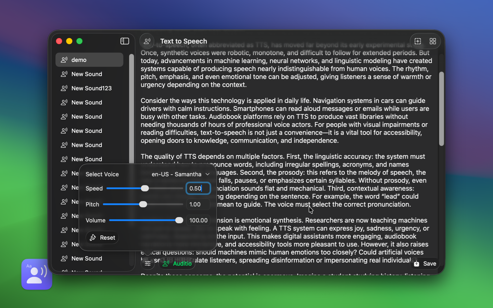

   
   
  
  <h1>TextSound Saver</h1>
  <!--rehype:style=border: 0;-->
  

		<a href="./README.md">English</a> • 
		<a href="https://wangchujiang.com/#/contact" target="_blank">联系&支持</a>
    <!--rehype:target=_blank-->
  

  

    
    
  

使用 TextSound 应用程序，您可以将文本转换为逼真的合成语音。应用实现了流畅且自然的文本到语音转换。除了提供出色的语音合成功能外，该应用还允许您轻松导出调好的音频文件。这使您能够创建高质量的音频文件，并下载输出以供其他用途。

有关支持语言的完整列表，请参见 [VoiceOver 支持的语言](https://support.apple.com/en-us/111748)

